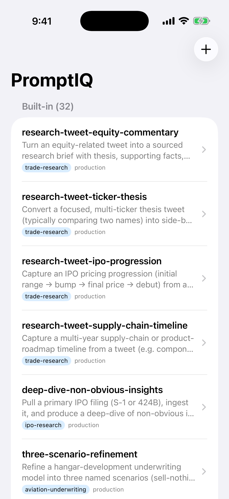

# PromptIQ Example — iOS

A small SwiftUI app that exercises the [PromptIQ](https://h9-prompt-iq.netlify.app) HTTP API end-to-end. Built as a reference: a few hundred lines, no third-party deps, real network calls against the live service.



## What it does

- **Browse**: lists the 32 built-in prompts (bundled JSON snapshot) plus any custom prompts you've created (live `GET /api/prompts`).
- **Read**: tap a prompt to see purpose, verbatim text, parameterized template, tags, score, and metadata.
- **Copy / share**: detail view has a copy-to-clipboard button and a native iOS `ShareLink`.
- **Create**: toolbar `+` opens a form that `POST`s a new custom prompt to the API.

Pull-to-refresh re-fetches customs. Errors surface as alerts.

## How to run it

You need full **Xcode 15+** (App Store, ~10 GB). Command Line Tools alone are not enough — `xcodebuild` needs a real Xcode developer dir to build an iOS app or boot the Simulator.

```bash
# 1. Install Xcode from the App Store (or:  open "macappstore://apps.apple.com/app/xcode/id497799835")
#    Wait for it to finish downloading.

# 2. One-time bootstrap (asks for sudo once, bundles license accept + first-launch):
bash scripts/finish-setup.sh

# 3. Build + install + launch + screenshot, anytime:
bash scripts/run-in-simulator.sh
```

If you'd rather drive the UI from Xcode: `open PromptIQExample.xcodeproj`, pick an iPhone simulator, ⌘R.

## What's stubbed

**Nothing.** The app talks to the real production API at `https://h9-prompt-iq.netlify.app/api/prompts` from launch. The shared secret (`X-PromptIQ-Key`) is fetched at startup from `https://h9-prompt-iq.netlify.app/config.local.js` — the same publicly-exposed key the web client uses — so no secret ships in the iOS binary. If PromptIQ rotates the key, the next cold-start picks it up automatically.

The 32 bundled built-in prompts are a static snapshot of `mcp-server/prompts.json` from the PromptIQ repo; refreshing them is a manual `cp` for now.

## Project layout

```
PromptIQExample/
  App.swift                       # @main, wires PromptLibrary into the environment
  Models/
    Prompt.swift                  # Codable, all optional except name/category
    Category.swift                # The 10 PromptIQ categories
  Networking/
    KeyProvider.swift             # actor — fetches & caches the shared secret
    PromptIQClient.swift          # URLSession wrapper: list + create
  ViewModels/
    PromptLibrary.swift           # @Observable, loads built-ins + customs
  Views/
    ContentView.swift             # NavigationStack root
    PromptListView.swift          # Sectioned list, pull-to-refresh, new button
    PromptDetailView.swift        # Scrollable detail, copy + ShareLink
    NewPromptView.swift           # Form → POST /api/prompts
  Resources/
    prompts.json                  # 199KB snapshot of built-in prompts (32 items)
project.yml                       # XcodeGen spec (avoids checking in .xcodeproj)
```

## What's next

- Swap the bundled `prompts.json` for a live fetch (PromptIQ would need to expose the built-ins JSON, or we hit `prompts.data.js` and parse the JS literal).
- Edit / delete custom prompts (`PUT`, `DELETE`).
- Search & filter by category / tag.
- Snapshot tests against the Codable model.
- Cache custom prompts to disk for offline.

See [`HOW_WE_BUILT_IT.md`](HOW_WE_BUILT_IT.md) for the build narrative.
